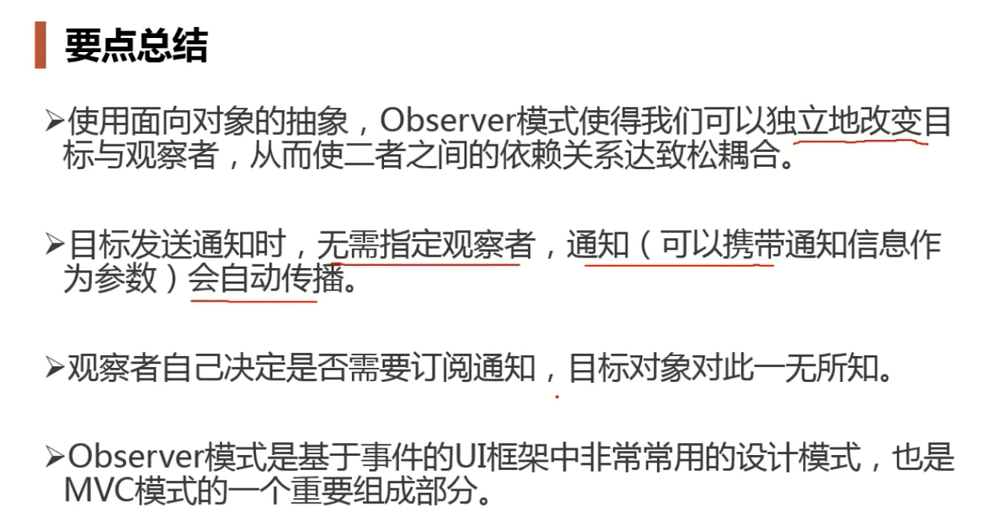
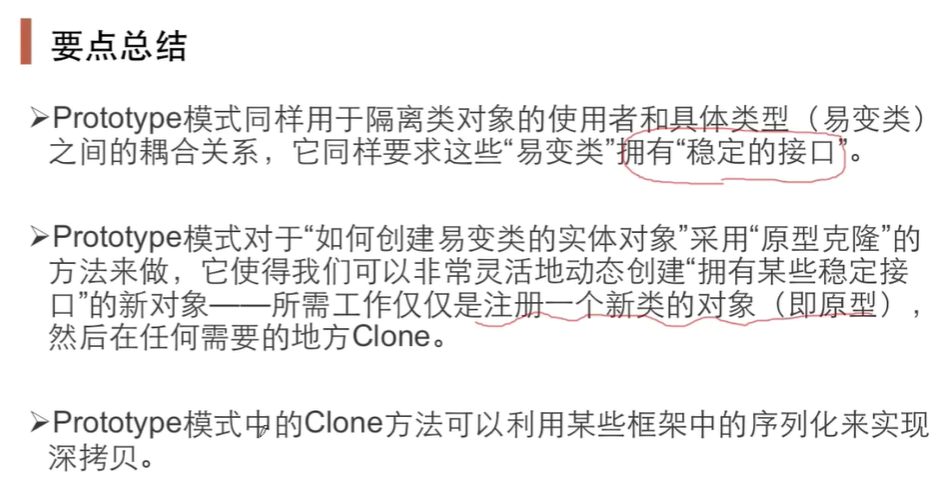

# 设计模式

## 第1集 设计模式简介

---

---

## 第2集 面向对象设计原则

 ---

---

---

---

---

---

---

---

--- 

---

---  

---

## 第3集 模板方法

### 1. Template Method 设计模式 

---

---

---

--- 

**以后每学一个设计模式就要这样通过红色框来表示稳定部分，蓝色框表示变化部分**

---

## 第4集 策略模式

### 2. Strategy 策略模式

用扩展的方式来应对未来算法需求的变化（增加子类）

 [19:00] 复用性：编译，部署之后二进制意义的复用,而不是某些不变的代码片段

---

---

## 第5集 观察者模式

### 3. Observer 观察者模式 

也叫Event

---

---

---

---

## 第6集 装饰模式

### 4. Decorator 装饰模式

具有扩展作用

特点：Decorator类，继承某一基类，然后类中又组合包含了基类成员

---

---

编译时装配和运行时装配

---

加入装饰器前的类结构

---

加入装饰器后的结构

---

---

---

---

---

## 第7集 桥模式

### 5. Bridge 桥模式

和装饰模式非常相似，但是桥模式并没有一个公共的祖先类，而是在抽象类中组合包含一个指向实现基类的指针

---

---

---

## 第8集 工厂方法

### 6. Factory Method 工厂方法

---

---

---

---

---

## 第9集 抽象工厂

### 7. Abstract Factory 抽象工厂

其实就是叫做Family Factory，让相互关联的工厂生产方法放在同一个工厂中

---

---

---

---

红色是稳定部分，不需要在改动

蓝色是一种变化方向，绿色是另一种变化方向

---

---

##   第10集 原型模式

### 8. Prototype 原型模式

通过克隆自己来创建对象

---

---

----

它和工厂方法的区别在于：如果当前对象状态很复杂，比如带有各种属性，若用工厂创建对象的话，这个创建方法会很麻烦，而如果当前直接有一个可用的对象，则以它作为原型，将其状态复制到新的对象再去操作，会更方便。

创建对象简单的情况可以用工厂，复杂用原型，两种都是来解决new的问题

---

---

---

## 第11集 构建器

### 9. Builder 构建器

没太看懂。。。

---

---

C++中，构造函数中使用当前类的虚函数只能实现静态绑定，不能实现动态绑定，若该虚函数是纯虚函数即并没有真正实现则会报错。

---

---

---

---

