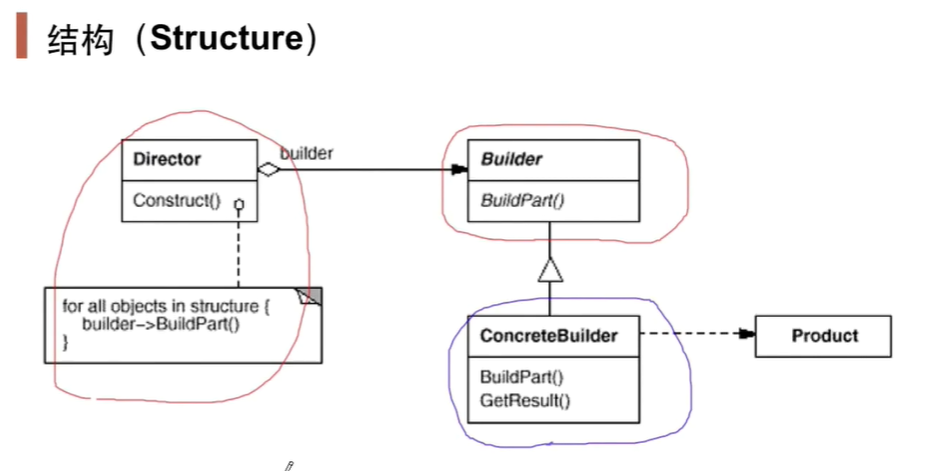
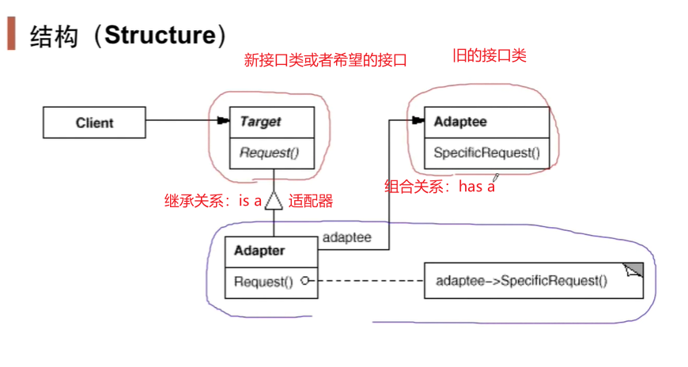

# 设计模式

## 第1集 设计模式简介

---

---

## 第2集 面向对象设计原则

 ---

---

---

---

---

---

---

---

--- 

---

---  

---

## 第3集 模板方法

### 1. Template Method 设计模式 

---

---

---

--- 


**以后每学一个设计模式就要这样通过红色框来表示稳定部分，蓝色框表示变化部分**

---

## 第4集 策略模式

### 2. Strategy 策略模式

用扩展的方式来应对未来算法需求的变化（增加子类）

 [19:00] 复用性：编译，部署之后二进制意义的复用,而不是某些不变的代码片段

---

---

## 第5集 观察者模式

### 3. Observer 观察者模式 

也叫Event

---

---

---

---


## 第6集 装饰模式

### 4. Decorator 装饰模式

具有扩展作用

特点：Decorator类，继承某一基类，然后类中又组合包含了基类成员

---


---

编译时装配和运行时装配

---

加入装饰器前的类结构

---

加入装饰器后的结构

---


---


---


---


---


## 第7集 桥模式

### 5. Bridge 桥模式

和装饰模式非常相似，但是桥模式并没有一个公共的祖先类，而是在抽象类中组合包含一个指向实现基类的指针


---


---


---


## 第8集 工厂方法

### 6. Factory Method 工厂方法

---


---


---


---


---


## 第9集 抽象工厂

### 7. Abstract Factory 抽象工厂

其实就是叫做Family Factory，让相互关联的工厂生产方法放在同一个工厂中

---


---


---


---

红色是稳定部分，不需要在改动

蓝色是一种变化方向，绿色是另一种变化方向

---


---

##   第10集 原型模式

### 8. Prototype 原型模式

通过克隆自己来创建对象

---


---


----

它和工厂方法的区别在于：如果当前对象状态很复杂，比如带有各种属性，若用工厂创建对象的话，这个创建方法会很麻烦，而如果当前直接有一个可用的对象，则以它作为原型，将其状态复制到新的对象再去操作，会更方便。

创建对象简单的情况可以用工厂，复杂用原型，两种都是来解决new的问题

---


---


---


## 第11集 构建器

### 9. Builder 构建器

没太看懂。。。

---


---

C++中，构造函数中使用当前类的虚函数只能实现静态绑定，不能实现动态绑定，若该虚函数是纯虚函数即并没有真正实现则会报错。

---


---



---


---


## 第12集 单件模式

### 10. Singleton 单件模式


---


---


---

分为线程非安全版本和线程安全版本：

线程非安全版本

```c++
class Singleton{
private:
    Singleton();
    Singleton(const Singleton& other);
public:
    static Singleton* getInstance();
    static Singleton* m_instance;
};

Singleton* Singleton::m_instance=nullptr;

//线程非安全版本
Singleton* Singleton::getInstance() {
    if (m_instance == nullptr) {
        m_instance = new Singleton();
    }
    return m_instance;
}
```

线程安全版本

- 加锁版本（锁的代价过高）

  ```C++
  //线程安全版本，但锁的代价过高
  Singleton* Singleton::getInstance() {
      Lock lock;
      if (m_instance == nullptr) {
          m_instance = new Singleton();
      }
      return m_instance;
  }
  ```

- 双检查锁，但由于内存读写reorder不安全

  reorder：代码变成机器指令序列后的重新排序

  问题来源于该条语句：`m_instance = new Singleton();`

  变成指令序列的理想顺序：

  1. 先分配内存
  2. 调用构造器
  3. 返回内存的地址（指针） m_instance就不是nullptr

  编译器编译出的实际指令序列的顺序很可能被reorder：

  1. 先分配内存
  2. 返回内存的地址（指针）
  3. 调用构造器

  这样当某个线程在完成2步骤后，并没有直接调用构造器，而是切换到其它线程开始执行该函数，则直接跳过if返回m_instance，但此时m_instance对应的内存空间上并没有可用的对象数据

  ```C++
  //双检查锁，但由于内存读写reorder不安全
  Singleton* Singleton::getInstance() {
      
      if(m_instance==nullptr){
          Lock lock;
          if (m_instance == nullptr) {
              m_instance = new Singleton();
          }
      }
      return m_instance;
  }
  ```

- C++ 11版本之后的跨平台实现（volatile）

  `std::atomic_thread_fence(std::memory_order_acquire);`这条语句执行完之后（获得内存屏障），可以保证`tmp = new Singleton;` 不会被reorder

  ```C++
  //C++ 11版本之后的跨平台实现 (volatile)
  std::atomic<Singleton*> Singleton::m_instance;
  std::mutex Singleton::m_mutex;
  
  Singleton* Singleton::getInstance() {
      Singleton* tmp = m_instance.load(std::memory_order_relaxed);
      std::atomic_thread_fence(std::memory_order_acquire);//获取内存fence
      if (tmp == nullptr) {
          std::lock_guard<std::mutex> lock(m_mutex);
          tmp = m_instance.load(std::memory_order_relaxed);
          if (tmp == nullptr) {
              tmp = new Singleton;
              std::atomic_thread_fence(std::memory_order_release);//释放内存fence
              m_instance.store(tmp, std::memory_order_relaxed);
          }
      }
      return tmp;
  }
  ```


---


---


## 第13集 享元模式

### 11. Flyweight 享元模式

解决性能性问题，而不是针对抽象性问题 

---


---


---


---


## 第14集 门面模式

### 13. Facade 门面模式

------


---


---


---


---


---


---


---


## 第15集 代理模式

### 14. Proxy 代理模式

重点！！！

[代理模式讲解网站]: https://blog.csdn.net/wuzhekai1985/article/details/6669219?spm=1001.2101.3001.6650.1&amp;amp;utm_medium=distribute.pc_relevant.none-task-blog-2%7Edefault%7ECTRLIST%7Edefault-1.pc_relevant_paycolumn_v2&amp;amp;depth_1-utm_source=distribute.pc_relevant.none-task-blog-2%7Edefault%7ECTRLIST%7Edefault-1.pc_relevant_paycolumn_v2&amp;amp;utm_relevant_index=2

---


---


---


---


---


---


## 第16集 适配器模式

### 15. Adapter 适配器模式

---


---


---



---

继承关系还可以表示子类遵循父类接口的规范

---


---


## 第17集 中介者模式

### 16. Mediator 中介者模式

---


---


---


---


---


---


---

### 四种隔离模式的对比

Facade是解决系统间或者是内外系统之间的紧密的依赖耦合关系的模式

Proxy是解决两个对象，因为安全或者其他的原因，需要被隔离，从而产生Proxy代理对象来进行细腻度的控制

Adapter是实现旧接口（不符合当前使用规范）对于新接口（当前使用规范）的适配

Mediator是解决系统内部不同对象之间的紧密的以来耦合关系的模式

